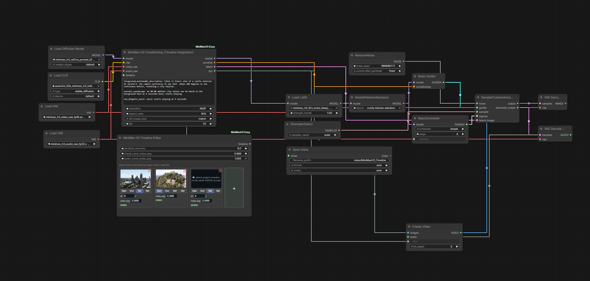

# ComfyUI-MiniMaxH3-Easy

A timeline-based editor for MiniMax H3 in ComfyUI that goes past what
either native mode (fl2va keyframes, ref2va references) supports alone:
keyframes and references combined in one generation, video keyframes that
stitch separate clips together, audio keyframes that pin a track to start
at an exact second, and genuine per-item control over how strongly each
piece of media is trusted -- none of which native code has a path for, not
just a bug-fix wrapper around what already existed. Two nodes: `MiniMax H3
Timeline Editor` and `MiniMax H3 Conditioning (Timeline Integration)`.



## Why this exists

Several real gaps in native ComfyUI's MiniMax H3 support, each confirmed
directly against the installed source (not assumed from community
explanations), each with no existing fix or code path to build on:

**Two real bugs blocked combining keyframes and references at all:**

1. `comfy/model_base.py`'s `MiniMaxH3.extra_conds` builds the conditioning
   video-latent list from keyframes, then unconditionally **overwrites** it
   with the reference list instead of concatenating the two -- with both
   present, the keyframe's own image data never reaches the model at all.
2. `comfy/ldm/minimax/model.py`'s `PackedLayout` anchors a "first" keyframe's
   rotary position to the raw text length, which is only correct when
   nothing precedes the video segment. Each reference pushes the video's
   real start later in the sequence, so with references present the
   keyframe ends up anchored to a point *before* the video actually begins.

Both get fixed by patching the loaded model's `extra_conds` (via
`model.clone().add_object_patch(...)`, the standard non-invasive override
mechanism -- no core files are edited) with a corrected version that
concatenates both latent lists and anchors keyframes against the real,
post-reference video origin.

**Video and audio keyframes don't exist anywhere in native code at all** --
not a bug, a missing capability. Native `PackedLayout` only ever builds a
single-frame keyframe segment, and native audio conditioning (`ref_audio`)
is never positioned inside the target's own timeline, only in a pretimeline
reference slot. This project extends the keyframe segment to support
multiple frames (a real video clip, not just a still) and adds an entirely
new segment kind for audio pinned to a specific point in the target's own
audio track -- both genuinely new, verified working through real generation
tests, not just assumed to work because the position math is consistent.

Native code reads `noise_aug` as one global scalar for the whole
generation, applied identically to every keyframe/reference row -- **native
code alone gives you no way to trust one item more than another.** This
project's per-item `noise_aug` field (on every card) fixes exactly that: it
patches the row-content and row-timestep pipelines so each item's own value
genuinely drives its own row, independently -- verified directly, not just
parsed and ignored.

**Multiple simultaneous reference characters work correctly out of the box**
once the two bugs above are fixed. An earlier iteration of this project
added a whole per-reference position/strength ("anchoring") system to try
to force multiple references into one shared scene; extensive same-seed A/B
testing showed that plain, unanchored multi-reference conditioning already
produces clean co-presence, so that system was removed rather than kept as
an unused, confusing knob.

## Nodes

### MiniMax H3 Timeline Editor

Upload media directly as cards (the same `/upload/image` endpoint native
`LoadImage` uses) rather than wiring in separate loader nodes -- click a card
to upload an image, video, or audio file, then mark its role:

- **Start** / **End** -- pins that media to the clip's first/last frame (or,
  for audio, the first/last point of the target's own audio track).
- **Mid** -- a keyframe placed at any point in the clip (`at:` seconds, not
  restricted to the two endpoints).
- **Ref** -- a reference for identity/character conditioning.

Start/End/Mid accept **image, video, or audio**. A video keyframe pins a
short clip (not just a single frame) starting at that point -- genuinely
useful for stitching separate pieces of footage together into one
generation, either as a hard cut or a smooth transition depending on
prompt/duration. An audio keyframe pins specific audio content (e.g. a
music track) to start at that exact point in the target's own audio;
verified accurate to the second. `Ref` only accepts image/video/audio for
identity/character conditioning, not keyframing.

Every card also has a **`noise_aug`** field (default 0.999, 1.0 = used
exactly as given). This is a real native MiniMax H3 mechanism made of two
parts that are normally tied to the same one global scalar: how much noise
gets blended into that row's own content, and how "resolved" the model is
told that row is (its apparent denoising timestep, which affects how much
the AdaLN/RoPE embeddings let it be reasoned about relative to the rest of
the sequence). Native code reads exactly one such value per generation for
each of those two things and applies it identically to every row of a kind;
this project patches `_cond_video_rows`/`_cond_audio_rows` (content) and
`_forward`'s `seg_t` construction (resolved-ness), via the same
`model.clone().add_object_patch(...)` mechanism used for the bug fixes
above, so each row's own value drives both independently -- verified
directly, not assumed (two rows with identical source content but
different `noise_aug` produced different, independently-controlled output).

Testing this against an actual hard-cut transition (see Tips below) found
`noise_aug` isn't a fix for that on its own -- lowering it only trades
cut-sharpness for content fidelity (noisier/less-accurate reproduction of
that item) along one axis, at every point along the range. The real cause
turned out to be something else entirely.

The Timeline Editor also has global `visual_cond_noise_aug` /
`audio_cond_noise_aug` settings, used as the fallback for any row that
doesn't set its own (e.g. if per-item support is ever removed, or for
items created before this existed).

An earlier iteration also
exposed `pretimeline_gap_seconds` (how far a reference's pre-timeline slot
sits from the video's real start); a direct A/B test (0.3s vs 3.0s, same
seed/prompt/references otherwise) showed no meaningfully different result,
so it was removed from the UI for the same reason the anchoring system was
-- it's a fixed default internally, not something worth exposing as a
setting users could mistakenly change expecting an effect.

### MiniMax H3 Conditioning (Timeline Integration)

Takes the timeline plus a `MODEL` / `CLIP` / `VAE` / `VAE` wired **directly
from native ComfyUI loader nodes** -- `Load Diffusion Model`, `Load CLIP`
with `type` set to `minimax`, and two `Load VAE` nodes -- not a bundle node
with internal fallback logic. Whatever checkpoint is visibly connected on
the canvas is what gets used; there's nothing to silently substitute.

`video_vae`/`audio_vae` are required inputs -- this node uses them
internally to encode keyframe/reference media into latents -- but are not
re-emitted as outputs. Outputs are just `model`, `positive` (conditioning),
`latent`, `fps`. Wire the *same* `Load VAE` nodes connected here directly to
`VAEDecode`/`VAEDecodeAudio` as well (one `Load VAE` feeding both this node
and the decoder, not a chain through this node) -- fan-out from a single
loader, not a passthrough dependency.

**`model` is the one output you must actually route through this node --
never bypass it with the loader's own `MODEL` output downstream (LoRA,
attention patches, sampling, etc.).** They are not the same object when a
keyframe and a reference are combined or a mid-clip keyframe is used: this
node clones the model and attaches the corrected `extra_conds` here --
that's where the two bug fixes above actually get applied. Wiring
`Load Diffusion Model`'s output around this node instead silently
reintroduces both bugs, with no error.

Typing `@` in the prompt shows the timeline's actual **reference** items and
their real `<Picture N>` / `<Video N>` / `<Audio N>` tags, computed the same
way the backend resolves them at generation time -- no guessing which tag
maps to which uploaded item. This is `Ref`-only, deliberately -- keyframes
have no tag mechanism to surface at all: a reference is a detached block
that needs a textual anchor telling the model which one to use where, but a
keyframe is already pinned to an exact position in the sequence, so there's
nothing to tag. You describe what happens at a keyframe in plain prose
(inside its `[Shot N]`), not by naming it.

## Tips

Patterns found through actual testing, not assumed -- added to as more come up.

- **Wire the Conditioning node's `fps` output into `CreateVideo`'s `fps`
  input, or the video plays back at the wrong speed with no error at all.**
  If left unwired, `CreateVideo` falls back to whatever its own `fps`
  widget is set to (its default, or whatever you last typed) instead of the
  rate the clip was actually generated at. Confirmed directly: a 7-second
  request played back as 5.83 seconds with this unwired -- 175 frames
  divided by the widget's 30fps instead of the actual 24fps the frames were
  generated at. See the example workflow below for what the correct wiring
  looks like.

- **This works well with the fl2va-only, ref2va-only, and combined
  fl2va_ref2va_adaln_blend checkpoints alike** -- comparing the same
  timeline/prompt across all three showed no meaningful output difference.
  That's not proof one checkpoint isn't better suited to some specific kind
  of shot than another -- only a limited set of image types/combinations
  has been tried so far. Experiment with checkpoint choice yourself rather
  than assuming this pack requires the blend checkpoint specifically.

- **A mid-clip keyframe "hard cutting" into place instead of transitioning
  smoothly is a duration problem, not a noise_aug problem.** A `Mid`
  keyframe is pinned to an exact frame; if `duration_seconds` is short,
  there simply aren't enough frames between the clip's start and that
  anchor point for the model to interpolate through, so it jumps instead of
  easing in. `noise_aug` only changes how that keyframe's own row is
  represented -- it can't create temporal room that isn't there. Increasing
  `duration_seconds` fixed a hard cut that no `noise_aug` value did.

- One-off observation, not verified across cases: lowering a *reference*
  item's `noise_aug` to around `0.8` was noticed to reduce clipping on
  something the reference character was holding (a sword), which looked
  worse/less clear at the `0.999` default. Could be worth experimenting
  with if you're seeing similar issues with a character's held items or
  movement -- not claiming this generalizes.

- **Music/audio appearing before it's supposed to (e.g. with an audio
  keyframe pinning a track to start partway through) is a prompt problem,
  not an audio-keyframe bug.** Confirmed the hard way: the same behavior
  happens with no audio keyframe at all, and persists even when the
  keyframe's content is made architecturally impossible to influence
  anything before its own anchor point -- so the model is generating this
  from the prompt/its own tendencies, not from the keyframe. Two things
  actually fixed it, using MiniMax H3's structured prompt fields
  (`integrated_multimodal_description` / `overall_soundscape` /
  `non_diegetic_music` -- see the model's own prompt guide for the full
  schema):
  1. State timing **positively**, never as a negation or `N/A`. "No music
     for the first four seconds" reliably failed; "music starts playing at
     00:04" reliably worked. Negation puts the word "music" in the prompt
     regardless of what's negating it.
  2. `overall_soundscape` covers the **entire clip's duration**, not a
     single snapshot -- if it describes only the pre-music ambience with
     no acknowledgment that music enters partway through, that silently
     contradicts `non_diegetic_music`'s claim that something changes.
     Anchor *both* the start and the transition explicitly, consistently
     across both fields. Confirmed working exactly as intended:

     ```text
     integrated_multimodal_description: [Shot 1] Static shot of a castle
     exterior. At second 4, the camera continuously in one shot whips 180
     degrees in one continuous motion, revealing a city skyline.

     overall_soundscape: at 00.00 ambient city noises can be heard in the
     background then at 4 seconds music starts playing

     non_diegetic_music: music starts playing at 4 seconds
     ```

## Installation

Clone (or copy) this repo into your ComfyUI `custom_nodes` directory:

```bash
cd ComfyUI/custom_nodes
git clone https://github.com/lukedude06/ComfyUI-MiniMaxH3-Easy.git
```

Restart ComfyUI. `MiniMax H3 Timeline Editor` and `MiniMax H3 Conditioning
(Timeline Integration)` will appear in the node search.

## Example workflow

[`workflow/MiniMaxH3_Timeline_Template.json`](workflow/MiniMaxH3_Timeline_Template.json)
is a real, correctly-wired workflow -- drag it into ComfyUI to load it
directly. It demonstrates a combined generation: a video keyframe pinning
the clip's start, a second video keyframe mid-clip, and an audio keyframe
pinning a music track partway through, all through the `ref2va` checkpoint.
Notably it has the `fps` output wired from the Conditioning node into
`CreateVideo`'s `fps` input -- the exact wiring gotcha documented in Tips
above, done correctly here so it's obvious what "correct" looks like rather
than only described in prose.

## Requirements

- ComfyUI with MiniMax H3 support (`comfy_extras/nodes_minimax_h3.py`).
- A MiniMax H3 diffusion checkpoint, a `minimax`-type CLIP/text-encoder
  checkpoint, and the MiniMax H3 video + audio VAEs, loadable through
  ComfyUI's native `Load Diffusion Model` / `Load CLIP` / `Load VAE` nodes.

No extra Python dependencies beyond what ComfyUI itself already ships with.

## How this was built

Most of the code here was written by Claude, via Claude Code,
working with the repo owner over a sustained, multi-session process -- not
a single generation. That process included reading the installed MiniMax
H3 / ComfyUI source directly to find the two native bugs this project
fixes, building and empirically testing each feature, and real dead ends
(tried, benchmarked or generation-tested, then reverted when they didn't
hold up) documented in git history and the Tips section above rather than
edited out. The repo owner directed the work throughout -- deciding what
to build, running the actual test generations, catching mistakes along
the way, and making the final call on every design decision here.

## License

MIT -- see [LICENSE](LICENSE).
